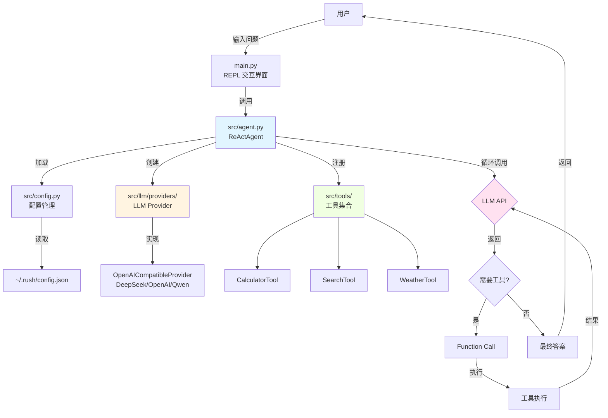
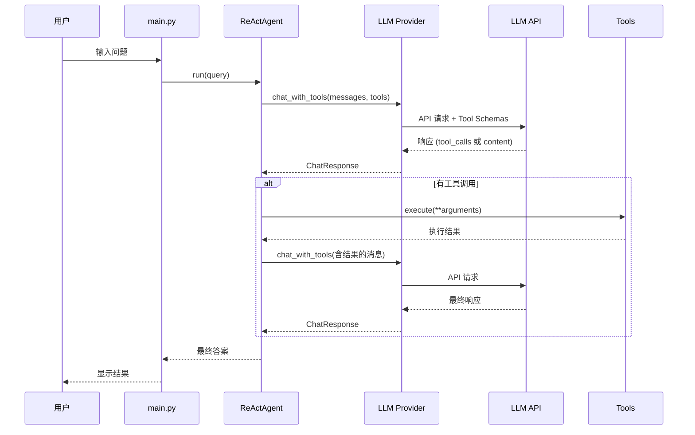

# Rush - ReAct Agent CLI

基于 ReAct(Reasoning + Acting)框架的命令行 AI Agent,使用 Function Calling 实现智能工具调用。

## 功能特性

- ✅ **Function Calling** - 使用结构化 API 进行工具调用,不占用上下文窗口
- ✅ **Provider 抽象层** - 支持多种 LLM 提供商(DeepSeek/OpenAI/Qwen),易于扩展
- ✅ **ReAct 框架** - Thought → Action → Observation 循环机制
- ✅ **模块化设计** - 配置、Agent、工具完全分离
- ✅ **REPL 交互界面** - 支持历史命令导航
- ✅ **自动配置管理** - 首次运行自动创建配置文件

## 项目结构

```
rush/
├── main.py                    # 主入口程序
├── config.json                # 配置文件模板
├── requirements.txt           # Python 依赖
├── .gitignore                 # Git 忽略文件
└── src/                       # 源代码目录
    ├── __init__.py
    ├── config.py              # 配置管理模块
    ├── agent.py               # ReAct Agent 核心
    ├── llm/                   # LLM Provider 模块
    │   ├── __init__.py
    │   └── providers/
    │       ├── __init__.py
    │       ├── base.py        # Provider 抽象基类
    │       └── openai_compatible.py  # OpenAI 兼容实现
    └── tools/                 # 工具模块
        ├── __init__.py
        ├── base.py            # 工具基类
        ├── calculator.py      # 计算器工具
        ├── search.py          # 搜索工具
        └── weather.py         # 天气工具
```

## 安装

1. 安装依赖:
```bash
pip install -r requirements.txt
```

2. 配置 API Key:
   - 首次运行时会自动创建配置文件 `~/.rush/config.json`
   - 编辑配置文件,填入你的 DeepSeek API Key:
```json
{
    "api_key": "your_deepseek_api_key_here",
    "base_url": "https://api.deepseek.com/v1",
    "model": "deepseek-chat"
}
```

## 使用方法

运行程序:
```bash
python main.py
```

### 内置命令

- `/exit` - 退出程序
- `/clear` - 清除对话历史
- `/help` - 显示帮助信息

### 可用工具

1. **calculator** - 执行数学计算
   ```
   calculator('2 + 2')
   calculator('10 * 5')
   ```

2. **search** - 搜索信息(模拟)
   ```
   search('Python ReAct 框架')
   ```

3. **weather** - 查询天气(模拟)
   ```
   weather('北京')
   ```

## 技术架构

### 系统架构图



### ReAct 工作流程图



### Function Calling vs Prompt-based

Rush 使用 **Function Calling** 模式,相比传统的提示词方式有显著优势:

| 特性 | Prompt-based | Function Calling (Rush) |
|------|-------------|------------------------|
| **上下文占用** | ❌ 工具描述占用 200-300 tokens | ✅ 仅占用 ~50 tokens |
| **解析可靠性** | ⚠️ 依赖正则,可能出错 | ✅ 结构化 JSON,100% 可靠 |
| **参数验证** | ❌ 需要手动验证 | ✅ API 层自动验证 |
| **扩展性** | ⚠️ 提示词会变很长 | ✅ 轻松支持数十个工具 |

### Provider 抽象层

Rush 设计了统一的 LLM Provider 接口,支持多种模型提供商:

```python
# 当前支持的 Provider
- OpenAICompatibleProvider: DeepSeek, OpenAI, Qwen(通义千问)

# 未来可扩展
- ClaudeProvider: Anthropic Claude
- GeminiProvider: Google Gemini
```

添加新 Provider 只需实现 `LLMProvider` 接口:

```python
from src.llm.providers.base import LLMProvider

class MyProvider(LLMProvider):
    def chat_with_tools(self, messages, tools):
        # 实现特定平台的工具调用逻辑
        ...
```

## 示例对话

### Function Calling 模式

```
[Rush] > 计算 123 * 456

============================================================
问题: 计算 123 * 456
============================================================

使用 Provider: OpenAI-Compatible (deepseek-chat)

[迭代 1/5]
调用工具: calculator({'expression': '123 * 456'})
工具结果: 计算结果: 56088

[迭代 2/5]

============================================================
最终答案: 123 × 456 = 56088
============================================================
```

## ReAct 框架说明

ReAct(Reasoning + Acting)框架通过以下循环工作:

1. **用户提问** - 用户输入问题
2. **LLM 决策** - LLM 分析是否需要调用工具
3. **工具调用** - 如需工具,LLM 返回结构化调用请求
4. **执行工具** - Agent 执行工具并获取结果
5. **返回结果** - 将结果反馈给 LLM
6. **生成答案** - LLM 根据结果生成最终答案

这种设计让 AI Agent 能够:
- ✅ 进行逻辑推理和问题分解
- ✅ 调用外部工具获取实时信息
- ✅ 根据工具返回结果调整策略
- ✅ 解决复杂的多步问题

### 工作流程图

```
用户问题 → LLM 分析 → 需要工具? 
              ↓           ↓
            否           是
              ↓           ↓
         直接回答    调用工具 → 执行 → 返回结果
                                  ↓
                            继续分析...
```

## 如何添加新工具

1. 在 `src/tools/` 目录下创建新工具文件
2. 继承 `Tool` 基类并实现两个方法:
   - `execute()` - 工具执行逻辑
   - `get_schema()` - Function Calling schema 定义
3. 在 `src/agent.py` 的 `_register_tools()` 中注册

示例:

```python
from src.tools.base import Tool

class MyTool(Tool):
    def __init__(self):
        super().__init__(
            name="my_tool",
            description="我的工具描述"
        )
    
    def execute(self, param: str) -> str:
        return f"结果: {param}"
    
    def get_schema(self):
        return {
            "type": "function",
            "function": {
                "name": self.name,
                "description": self.description,
                "parameters": {
                    "type": "object",
                    "properties": {
                        "param": {"type": "string"}
                    },
                    "required": ["param"]
                }
            }
        }
```

## 配置文件位置

配置文件存储在: `~/.rush/config.json`

## 技术栈

- **Python** 3.x
- **openai** >= 1.0.0 - OpenAI 兼容 API 客户端
- **prompt_toolkit** >= 3.0.0 - 命令行交互界面
- **DeepSeek API** - 大语言模型服务

### 支持的 LLM 提供商

- ✅ **DeepSeek** - deepseek-chat (默认)
- ✅ **OpenAI** - gpt-4, gpt-3.5-turbo
- ✅ **Qwen** - 通义千问 (兼容模式)
- 🔜 **Claude** - 待实现
- 🔜 **Gemini** - 待实现

## 许可证

MIT License
